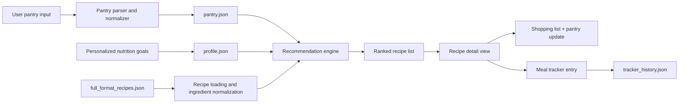

# ShelfAware MVP Report

## Executive Summary UPDATE
ShelfAware is a pantry-aware meal recommendation tool for students and busy home cooks. The Phase 3 MVP helps a user enter the ingredients they already have, set nutrition preferences, receive recipe suggestions from a large recipe dataset, and track meals against a daily protein goal.

Compared with the Phase 2 prototype, this MVP is much closer to a usable product. It now includes a persistent pantry, a larger recipe database, cleaner recommendation output, recipe detail views, a saved body-goals profile, and a daily meal tracker.

## User and Use Case
The main target user is a college student or young adult with groceries at home who does not know what to 
cook and wants a meal that matches nutrition goals. A second target user is a busy home cook who wants to 
reduce waste by using ingredients already in the pantry before buying more food.

A realistic user scenario is:
1. a user opens ShelfAware after class or work,
2. checks or updates the pantry,
3. enters a meal calorie limit and minimum protein target,
4. gets recipe suggestions that use pantry ingredients,
5. opens a recipe to view ingredient details and missing items,
6. logs the chosen meal into the tracker,
7. updates pantry amounts based on what was used.

This use case fits the original product idea well because the user problem is not just “find any recipe.”
The real pain point is finding a recipe that is practical **right now**, given pantry inventory and
nutrition goals at the same time.

## System Design
The MVP is implemented as a local Python command-line application inside `/mvp/`. The app layer handles user interaction, while the engine handles dataset loading, pantry parsing, normalization, ranking, tracking, and pantry updates. The backend currently loads recipe data from `full_format_recipes.json` and user state from `pantry.json`, `profile.json`, and `tracker_history.json`. 



Main files:

- `shelfaware_mvp.py`: main CLI app entrypoint and menu flow
- `engine.py`: recipe loading, pantry parsing, recommendation logic, tracker logic, and shopping list generation
- `make_trimmed_dataset.py`: recipe dataset
- `user_pantry.json`: saved pantry items preprocessing script used to create `full_format_recipes.json`
- `full_format_recipes.json`: processed recipe dataset used by the MVP
- `pantry.json`: persistent pantry state
- `persistent.json`: persistent nutrition goal profile
- `tracker_history.json`: saved meal history

Current Reccomendation Flow:
The current recommendation logic combines:

- pantry overlap between user pantry items and recipe ingredients,
- calorie and protein filtering,
- optional fat or sodium filtering,
- serving-size suggestion logic,
- pantry-based usefulness ranking.

The system also supports:

- recipe detail views,
- scaled ingredient display,
- shopping list generation,
- pantry subtraction after cooking,
- daily and monthly meal tracking.

## Data UPDATE AND FINISH


## Models and Methods
ShelfAware is a recommendation workflow rather than a trained machine learning model. The MVP uses:

- ingredient normalization,
- heuristic ingredient matching,
- nutrition-aware scoring,
- result ranking,
- meal logging against a protein goal.

This was a practical choice for the course MVP. It keeps the project easy to run locally, easy to explain during demo, and reproducible without external dependencies.

For each recipe, the system:

1. normalizes recipe ingredients,
2. compares them against the pantry,
3. computes pantry coverage,
4. rewards recipes that meet calorie and protein preferences,
5. optionally filters on an additional watched macro such as sodium or fat,
6. ranks results by fit score and pantry usefulness.

For body goals, the app stores weight, height, and goal type, then estimates a daily protein target. Users can log either a recommended recipe or a manually entered meal into the daily tracker.

## Evaluation
Evaluation for this MVP is mainly qualitative and product-focused.

### What the MVP does successfully

- stores pantry items across runs,
- searches a recipe space far larger than the Phase 2 hard-coded set,
- supports calorie and protein filtering,
- supports an optional extra macro watch for fat or sodium,
- hides recipes that are missing core calorie or protein data,
- shows a cleaner ranked list before opening full recipe details,
- stores body-goal information and estimates a daily protein target,
- lets users track meals against that target.

### Example usage scenario

If a user stores a pantry such as:

`chicken, rice, spinach, onion, garlic, olive oil, eggs`

and requests recommendations with:

- max calories: `650`
- minimum protein: `30`
- optional extra macro watch: `fat` or `sodium`

the app returns ranked meals that use existing pantry items and better fit the user’s nutrition goals. If the user opens a recipe, the app shows ingredients, directions, missing items, and an option to log the meal into the daily tracker.

### Reproducibility

The MVP is reproducible locally with:

```bash
cd mvp
python3 shelfaware_mvp.py
```

or:

```bash
cd mvp
python3 shelfaware_mvp.py --demo
```

No external Python packages are required.

## Limitations and Risks

1. Ingredient matching is still heuristic, so some recipe matches may be imperfect.
2. The dataset is large, but some ingredient names remain messy after normalization.
3. Protein-target estimation is simple and meant for MVP guidance, not medical advice.
4. The food tracker logs meal totals but does not yet support editing old entries, portion scaling, or micronutrient tracking.
5. The interface is still command-line based, which limits usability compared with a web or mobile interface.
6. Receipt OCR and automatic pantry updates are still future work.

## Next Steps
With 2 to 3 more months, the highest-value upgrades would be:

- a web interface using Streamlit or Flask,
- receipt OCR for automatic pantry updates,
- stronger ingredient ontology and substitution logic,
- multi-day meal planning and grocery list export,
- better tracker features such as meal editing and calorie-goal support,
- real user testing with students to measure recommendation quality and usefulness.

## Summary of Phase 3 Progress
Phase 3 moved ShelfAware from a narrow prototype to a more complete MVP attempt. The project now has a persistent pantry, a large local recipe dataset, nutrition-aware recommendation logic, cleaner recipe browsing, a body-goals profile, and a daily protein tracker. This makes the final MVP much closer to the original product idea and gives the project a stronger base for future development.

## Demo Video
insert link here for demo video
