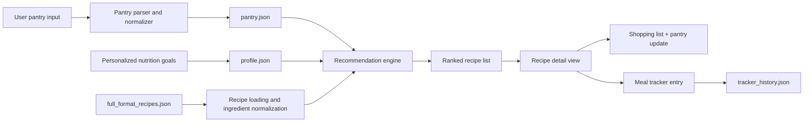

# ShelfAware MVP Report

## Executive Summary 
ShelfAware is a pantry-aware meal recommendation MVP for students and busy home cooks. The system helps users 
store pantry items, generate recipe suggestions from a processed recipe dataset, set personalized nutrition 
goals, log meals, and update pantry inventory after cooking. 

The current MVP runs locally as a Python command-line app through `shelfaware_mvp.py`, with recommendation
, pantry, and tracker logic handled by the backend engine. Compared with the earlier prototype, it now includes
persistent pantry storage, saved nutrition goals, meal tracking, a larger processed recipe dataset, and a 
reproducible quick demo mode. 

This MVP is not yet a fully trained end-to-end machine learning system. Instead, it is a practical 
recommendation workflow built around ingredient normalization, pantry parsing, nutrition-aware filtering, and 
recipe ranking over real data. That was the most realistic way to build a working, reproducible product within 
the course timeline.

## User and Use Case
The main target user is a college student or young adult with groceries at home who does not know what to 
cook and wants a meal that matches nutrition goals. A second target user is a busy home cook who wants to 
reduce waste by using ingredients already in the pantry before buying more food.

A realistic user scenario is:
1. a user opens ShelfAware after class or work,
2. checks or updates the pantry,
3. enters a meal calorie limit and minimum protein target,
4. gets recipe suggestions that use pantry ingredients,
5. opens a recipe to view ingredient details and missing items,
6. logs the chosen meal into the tracker,
7. updates pantry amounts based on what was used.

This use case fits the original product idea well because the user problem is not just “find any recipe.”
The real pain point is finding a recipe that is practical **right now**, given pantry inventory and
nutrition goals at the same time.

## System Design
The MVP is implemented as a local Python command-line application inside `/mvp/`. The app layer handles user interaction, while the engine handles dataset loading, pantry parsing, normalization, ranking, tracking, and pantry updates. The backend currently loads recipe data from `full_format_recipes.json` and user state from `pantry.json`, `profile.json`, and `tracker_history.json`. 



### Main files:

- `shelfaware_mvp.py`: main CLI app entrypoint and menu flow
- `engine.py`: recipe loading, pantry parsing, recommendation logic, tracker logic, and shopping list generation
- `make_trimmed_dataset.py`: recipe dataset
- `user_pantry.json`: saved pantry items preprocessing script used to create `full_format_recipes.json`
- `full_format_recipes.json`: processed recipe dataset used by the MVP
- `pantry.json`: persistent pantry state
- `profile.json`: persistent nutrition goal profile
- `tracker_history.json`: saved meal history

### Current Reccomendation Flow:

The current recommendation logic combines:

- pantry overlap between user pantry items and recipe ingredients,
- calorie and protein filtering,
- optional fat or sodium filtering,
- serving-size suggestion logic,
- pantry-based usefulness ranking.

The system also supports:

- recipe detail views,
- scaled ingredient display,
- shopping list generation,
- pantry subtraction after cooking,
- daily and monthly meal tracking.

## Data 
The MVP uses a processed recipe dataset stored locally as `full_format_recipes.json`. The app does not directly
use the raw CSV during normal execution; instead, the raw source dataset is preprocessed into the JSON schema 
expected by the engine. The current recipe records include fields such as title, URL, ingredient lines, 
categories, calories, protein, carbs, fat, sodium, and rating. That matches what the engine currently loads 
and uses.

### Data Source

The raw source data used for this project came from the public Hugging Face dataset `datahiveai/recipes-with-nutrition`, which is in CSV format.

### Processed dataset used by the MVP

For local reproducibility and faster runtime, the raw source data was converted into a processed JSON file used by the app: 
`full_format_recipes.json`

Typical fields used by the MVP are 
- title
- url
- ingredients
- categories
- calories
- protein
- carbs
- fat
- sodium

### Preprocessing

The preprocessing step converts the raw recipe dataset into the format expected by the app. In practice, this includes:

- keeping fields needed by the MVP,
- converting ingredient lines into a consistent list format,
- keeping nutrition values,
- storing recipe URLs,
- simplifying metadata for easier local loading.

After that, the engine performs additional ingredient normalization during runtime. For example, it maps 
related ingredient names to pantry-friendly forms such as:

`chicken breast` → `chicken`

`red bell pepper` → `bell pepper`

`kosher salt` → `salt`

This step was important because raw ingredient strings are messy, inconsistent, and often too specific for 
direct pantry matching.

## Models and Methods
ShelfAware is best described as a data-driven recommendation system rather than a trained ML model. The current MVP does not fine-tune or train a neural network. Instead, it uses a structured workflow with:
- ingredient normalization,
- pantry parsing,
- pantry overlap scoring,
- nutrition-aware filtering,
- serving suggestion logic,
- ranked output generation.

That was the most realistic technical approach for the course timeline because it produced a working MVP that is easy to run locally and easy to explain during demo.

### What the current system does

For each recipe, the engine:

- loads ingredient lines from the processed JSON dataset,
- normalizes ingredient names into pantry-friendly forms,
- compares normalized recipe ingredients against the saved pantry,
- calculates pantry overlap and missing ingredients,
- checks nutrition constraints such as calories and protein,
- optionally filters on sodium or fat,
- ranks the remaining recipes by overall fit.

The app also estimates daily nutrition targets from:

- weight,
- height,
- goal type (cut, maintain, or muscle building),

and stores those targets in the saved profile. The tracker then compares logged meals against daily calorie and protein goals.

### AI Value in this MVP
The AI-enabled part of the MVP is not a large trained model. Instead, it comes from combining:
- real recipe data,
- personalized nutrition constraints,
- pantry-aware filtering,
- ingredient normalization and matching,
- useful recommendation ranking.

## Evaluation
Evaluation for this MVP is mainly qualitative and product-focused, because the current system is a 
recommendation workflow rather than a benchmarked predictive model.

### What Works Well

The MVP currently demonstrates these successful behaviors:

- persistent pantry storage across runs
- recipe generation from a much larger dataset than the early prototype
- calorie and protein filtering
- optional fat or sodium filtering
- saved nutrition goals
- daily and monthly meal tracking
- pantry updates after cooking
- shopping list generation for missing ingredients
- quick demo mode for reproducibility

### Example product evaluation scenario

A useful qualitative test case is:

- pantry contains items like chicken, onion, bell pepper, eggs, milk, rice, olive oil, and common spices
- user asks for meals under a calorie limit with a minimum protein target
- the app returns ranked recipes using current pantry ingredients
- the user opens one recipe and sees:
-- ingredient list
-- missing ingredients
-- shopping list
-- scaled servings
-- calorie and protein fit
-the user logs the recipe and updates pantry amounts

### Error Analysis
The biggest current failure mode is ingredient parsing. Real recipe text includes:

- branded ingredient names,
- vague ingredient lines,
- package-size syntax,
- mixed units,
- optional or serving-only ingredients.

To reduce errors, the parser was improved iteratively with:

- more ingredient aliases,
- better unit normalization,
- better handling of package sizes and common recipe formatting,
- safer skipping of vague lines like “salt and pepper to taste.”

Even after those improvements, pantry subtraction is still heuristic and not perfect.

### Reproducibility

The MVP is reproducible locally with:

```bash
cd mvp
python3 shelfaware_mvp.py
```

or:

```bash
cd mvp
python3 shelfaware_mvp.py --demo
```

No external Python packages are required.

## Limitations and Risks
The current MVP still has several important limitations
### 1. Ingredient parsing is heuristic

Real-world recipe text is messy. Even after many parsing fixes, some lines are still skipped or approximated.

### 2. Pantry subtraction is approximate

Some ingredients require count-to-weight or count-to-volume conversions, which are inherently approximate.

### 3. Nutrition targets are simplified

Protein and calorie targets are rough guidance values for an MVP and are not medical or dietetic advice.

### 4. No trained recommendation model

The current system does not learn from user behavior yet. Recommendations are based on logic and ranking 
rules, not trained personalization.

### 5. CLI interface only

The MVP is currently a command-line app, which limits ease of use for non-technical users.

### 6. Dataset quality issues

The raw dataset is large and useful, but some ingredient strings are inconsistent, branded, vague, or 
incomplete. That directly affects pantry matching quality.

### 7. Privacy and product risks

A future production version would need to handle user pantry data, nutrition preferences, and possibly receipt
data more carefully. The current MVP is local and lightweight, so privacy risk is low, but this would matter 
much more in a deployed version.

## Next Steps
With a couple more months, the most important long-term goal would be to move from a rules-based MVP to a more personalized assistant that learns user preferences over time. The next steps to do this would be:

### Technical next steps
- move from CLI to a web interface such as Streamlit or Flask
- improve the pantry parser using dataset-wide overrides or structured ingredient parsing
- add stronger substitution logic and ingredient ontology support
- support editing or deleting old tracker entries
- add meal-planning across multiple days
- improve shopping list grouping and export
- experiment with learned ranking or personalization
  
### Product next steps
- add receipt OCR for pantry updates
- support multi-user households
- allow users to save favorite meals
- add “low stock” pantry reminders
- run real user testing with students to measure usefulness and identify friction points

## Demo Video
[Demo Video (Zoom)](https://asu.zoom.us/rec/share/trKogU_dmoKja2YDa5EGp-OtDeRP4Ls9s6a4QcUZDIcBp5shAIPQnCzzJ9GhPeds.V14Ya3tIfWGU229L)  
Passcode: `E0=6$O&J`
