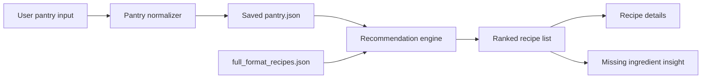

ShelfAware MVP Report

## Executive Summary
ShelfAware helps users decide what to cook from ingredients they already have while staying close to personal nutrition goals. The Phase 3 MVP is a user-friendly command-line application that stores a pantry, searches a recipe dataset of about 20,000 recipes, ranks meals by pantry overlap and nutrition fit, and shows recipe details, shopping gaps, and pantry insights.

The MVP now does more than the Phase 2 prototype. Instead of using a tiny hard-coded recipe list and a one-time terminal prompt, ShelfAware now supports a persistent pantry, a much larger search space, more flexible nutrition filters, and more informative outputs for the user.

## User and Use Case
The target user is a student or busy home cook who already has some groceries at home but does not know what meals are realistic without buying many extra items. A realistic use case is a student opening ShelfAware after class, entering the items already in the apartment kitchen, and asking for a high-protein dinner under a calorie target. The app returns ranked recipes, shows which ingredients are already covered, points out missing items, and lets the user open one recipe for full ingredients and directions.

## System Design
The MVP is implemented as a local Python application inside `/mvp/`.



Main components:

- `demo.py`: interactive menu and non-interactive demo mode.
- `engine.py`: pantry normalization, recipe loading, scoring, ranking, and insight generation.
- `pantry.json`: saved pantry state between runs.
- `full_format_recipes.json`: local recipe dataset used for recommendations.

The ranking logic combines:

1. pantry coverage, meaning how many recipe ingredients match the saved pantry,
2. nutrition preference alignment for calories, protein, and sodium,
3. recipe rating as a lightweight quality signal.

The system supports both flexible ranking and a strict mode that hides recipes outside the target filters.

## Data
The main dataset is `mvp/full_format_recipes.json`, which contains about 20,130 recipes. Each recipe may include:

- title,
- ingredients,
- directions,
- calories,
- protein,
- fat,
- sodium,
- rating,
- categories.

The project uses a local copy of the dataset already present in the repository. During preprocessing, ShelfAware normalizes ingredient strings to simpler pantry-friendly names, such as mapping `chicken breast` to `chicken` and `brown rice` to `rice`. This improves matching between how a user describes pantry items and how ingredients appear in recipes.

## Models and Methods
ShelfAware is not a trained predictive model. It is a recommendation workflow that uses:

- ingredient normalization,
- fuzzy ingredient matching,
- nutrition-aware scoring,
- result ranking and filtering.

This choice was intentional for the MVP. It keeps the system easy to run locally, easy to explain, and easy to demonstrate in class. The recommendation engine uses only the Python standard library, which improves reproducibility and avoids dependency issues during grading.

The scoring process for each recipe includes:

1. matching normalized pantry items against normalized recipe ingredients,
2. calculating pantry coverage,
3. checking whether the recipe satisfies calorie, protein, and sodium preferences,
4. assigning a combined score based on coverage, target alignment, and rating.

## Evaluation
Evaluation for this MVP is primarily qualitative and product-oriented.

### What the MVP now does successfully

- stores a pantry across runs instead of asking for one-time input only,
- searches a recipe dataset far larger than the Phase 2 hard-coded set,
- accepts multiple nutrition constraints,
- returns ranked recommendations instead of raw matches,
- shows missing ingredients for grocery planning,
- shows the first recipe step and allows full recipe inspection,
- summarizes commonly missing ingredients across the top results.

### Example scenario

If a user stores a pantry such as:

`chicken, rice, spinach, onion, garlic, olive oil, eggs`

and requests recipes with:

- maximum calories: `650`,
- minimum protein: `30`,
- optional sodium limit,

the app returns top-ranked meals that are likely to use those pantry items while meeting the nutrition goal as closely as possible.

### Reproducibility

The MVP is reproducible locally using:

```bash
cd mvp
python3 demo.py
```

or

```bash
cd mvp
python3 demo.py --demo
```

No external Python packages are required.

## Limitations and Risks

1. Ingredient matching is heuristic. It is much better than exact matching, but it can still miss some ingredient equivalences or create imperfect matches.
2. The dataset is broad, but the nutrition fields are incomplete for some recipes. Missing values are handled gracefully, but they reduce ranking precision.
3. The MVP is still command-line based rather than a web or mobile interface.
4. The pantry is persistent, but receipt parsing and automatic inventory updates are not yet implemented.
5. The system does not yet estimate substitutions, portion resizing, or dynamic nutrition recalculation.

## Next Steps
With 2 to 3 more months, the most valuable product and technical upgrades would be:

- a web interface using Streamlit or Flask,
- receipt OCR and automatic pantry updates,
- stronger ingredient ontology and substitution logic,
- explicit breakfast/lunch/dinner personalization,
- grocery list export and meal planning for multiple days,
- user testing with students to measure whether the recommendations are genuinely useful.

## Summary of Phase 3 Progress
Phase 3 turns ShelfAware from a narrow prototype into a more complete MVP attempt. The project now has a persistent pantry, a much larger recipe database, nutrition-aware ranking, recipe detail views, and more user-facing outputs. This is closer to the original product idea and provides a stronger foundation for future AI features such as receipt parsing, pantry memory, and smarter meal planning.
